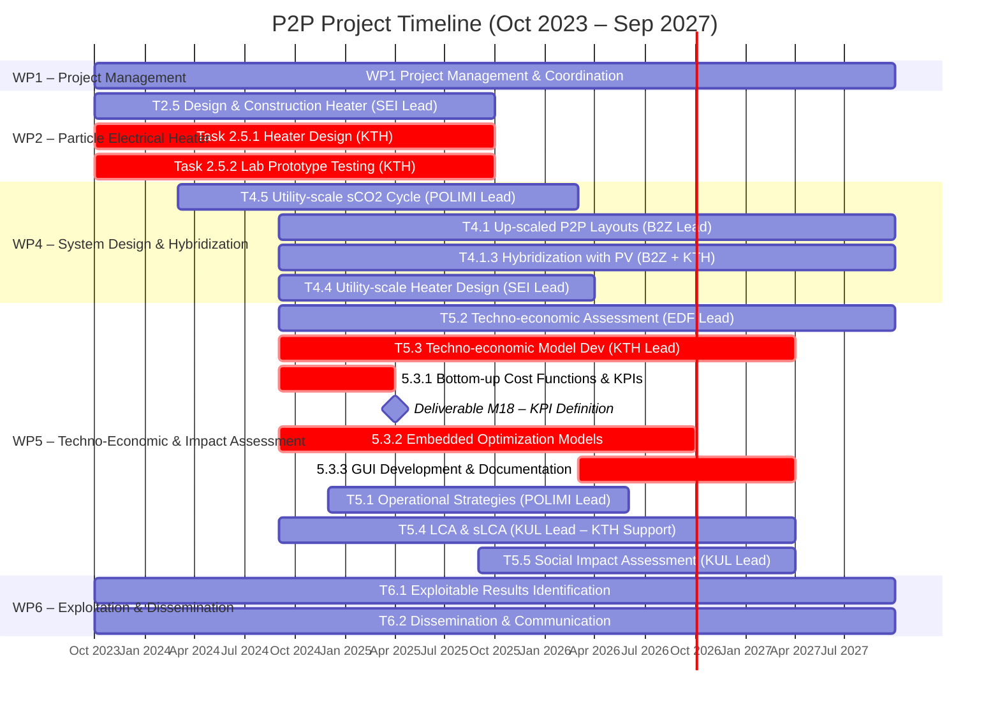

#Olika Projekt Timelines etc.

```mermaid
gantt
    title P2P Project Timeline (Oct 2023 – Sep 2027)
    dateFormat  YYYY-MM-DD
    axisFormat  %b %Y

    %% =========================
    section WP1 – Project Management
    WP1 Project Management & Coordination :wp1, 2023-10-01, 2027-09-30

    %% =========================
    section WP2 – Particle Electrical Heater
    T2.5 Design & Construction Heater (SEI Lead) :wp2a, 2023-10-01, 2025-09-30
    Task 2.5.1 Heater Design (KTH) :crit, wp2b, 2023-10-01, 2025-09-30
    Task 2.5.2 Lab Prototype Testing (KTH) :crit, wp2c, 2023-10-01, 2025-09-30

    %% =========================
    section WP4 – System Design & Hybridization
    T4.5 Utility-scale sCO2 Cycle (POLIMI Lead) :wp4a, 2024-03-01, 2026-02-28
    T4.1 Up-scaled P2P Layouts (B2Z Lead) :wp4b, 2024-09-01, 2027-09-30
    T4.1.3 Hybridization with PV (B2Z + KTH) :wp4c, 2024-09-01, 2027-09-30
    T4.4 Utility-scale Heater Design (SEI Lead) :wp4d, 2024-09-01, 2026-03-31

    %% =========================
    section WP5 – Techno-Economic & Impact Assessment
    T5.2 Techno-economic Assessment (EDF Lead) :wp5a, 2024-09-01, 2027-09-30
    T5.3 Techno-economic Model Dev (KTH Lead) :crit, wp5b, 2024-09-01, 2027-03-31
    5.3.1 Bottom-up Cost Functions & KPIs :crit, wp5c, 2024-09-01, 2025-03-31
    Deliverable M18 – KPI Definition :milestone, m18, 2025-03-31, 0d
    5.3.2 Embedded Optimization Models :crit, wp5d, 2024-09-01, 2026-09-30
    5.3.3 GUI Development & Documentation :crit, wp5e, 2026-03-01, 2027-03-31
    T5.1 Operational Strategies (POLIMI Lead) :wp5f, 2024-12-01, 2026-05-31
    T5.4 LCA & sLCA (KUL Lead – KTH Support) :wp5g, 2024-09-01, 2027-03-31
    T5.5 Social Impact Assessment (KUL Lead) :wp5h, 2025-09-01, 2027-03-31

    %% =========================
    section WP6 – Exploitation & Dissemination
    T6.1 Exploitable Results Identification :wp6a, 2023-10-01, 2027-09-30
    T6.2 Dissemination & Communication :wp6b, 2023-10-01, 2027-09-30
```

```mermaid
    gantt
    title P2P Project Timeline (Oct 2023 – Sep 2027)
    dateFormat  YYYY-MM-DD
    axisFormat  %b %Y

    %% =========================
    section WP1 – Project Management
    WP1 Project Management & Coordination :wp1, 2023-10-01, 2027-09-30

    %% =========================
    section WP2 – Particle Electrical Heater
    T2.5 Design & Construction Heater (SEI Lead) :wp2a, 2023-10-01, 2025-09-30
    Task 2.5.1 Heater Design (KTH) :crit, wp2b, 2023-10-01, 2025-09-30
    Task 2.5.2 Lab Prototype Testing (KTH) :crit, wp2c, 2023-10-01, 2025-09-30

    %% =========================
    section WP4 – System Design & Hybridization
    T4.5 Utility-scale sCO2 Cycle (POLIMI Lead) :wp4a, 2024-03-01, 2026-02-28
    T4.1 Up-scaled P2P Layouts (B2Z Lead) :wp4b, 2024-09-01, 2027-09-30
    T4.1.3 Hybridization with PV (B2Z + KTH) :wp4c, 2024-09-01, 2027-09-30
    T4.4 Utility-scale Heater Design (SEI Lead) :wp4d, 2024-09-01, 2026-03-31

    %% =========================
    section WP5 – Techno-Economic & Impact Assessment
    T5.2 Techno-economic Assessment (EDF Lead) :wp5a, 2024-09-01, 2027-09-30
    T5.3 Techno-economic Model Dev (KTH Lead) :crit, wp5b, 2024-09-01, 2027-03-31
    5.3.1 Bottom-up Cost Functions & KPIs :crit, wp5c, 2024-09-01, 2025-03-31
    Deliverable M18 – KPI Definition :milestone, m18, 2025-03-31, 0d
    5.3.2 Embedded Optimization Models :crit, wp5d, 2024-09-01, 2026-09-30
    5.3.3 GUI Development & Documentation :crit, wp5e, 2026-03-01, 2027-03-31
    T5.1 Operational Strategies (POLIMI Lead) :wp5f, 2024-12-01, 2026-05-31
    T5.4 LCA & sLCA (KUL Lead – KTH Support) :wp5g, 2024-09-01, 2027-03-31
    T5.5 Social Impact Assessment (KUL Lead) :wp5h, 2025-09-01, 2027-03-31

    %% =========================
    section WP6 – Exploitation & Dissemination
    T6.1 Exploitable Results Identification :wp6a, 2023-10-01, 2027-09-30
    T6.2 Dissemination & Communication :wp6b, 2023-10-01, 2027-09-30
```
