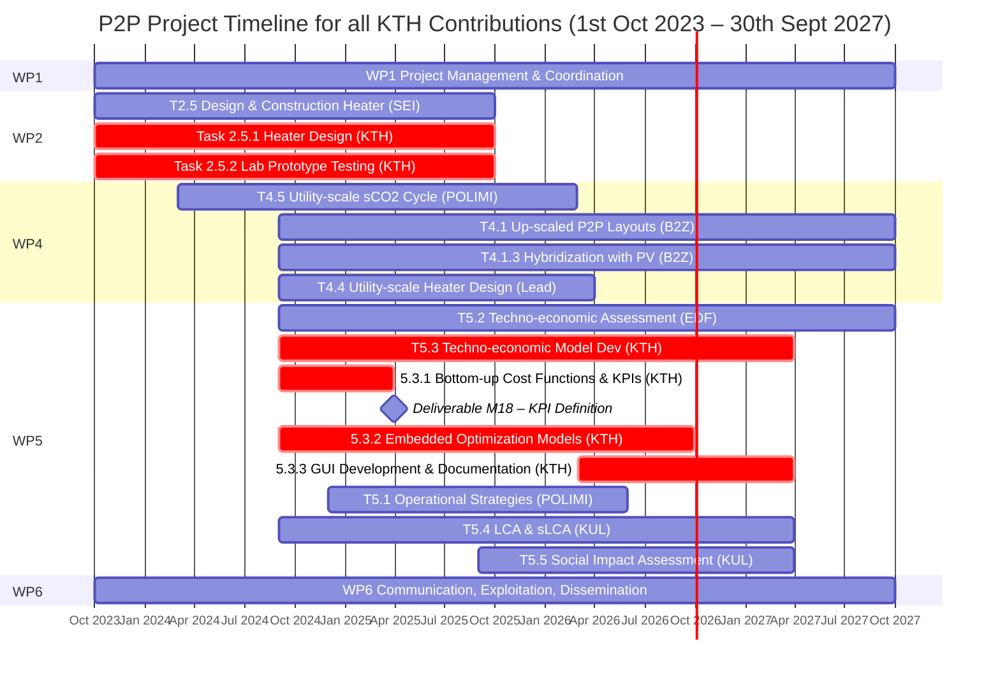

#Olika Projekt Timelines etc.

```mermaid
gantt
    title P2P Project Timeline for all KTH Contributions (1st Oct 2023 – 30th Sept 2027)
    dateFormat  YYYY-MM-DD
    axisFormat  %b %Y

    %% =========================
    section WP1 
    WP1 Project Management & Coordination :wp1, 2023-10-01, 2027-10-01

    %% =========================
    section WP2 
    T2.5 Design & Construction Heater (SEI) :wp2a, 2023-10-01, 2025-09-30
    Task 2.5.1 Heater Design (KTH) :crit, wp2b, 2023-10-01, 2025-09-30
    Task 2.5.2 Lab Prototype Testing (KTH) :crit, wp2c, 2023-10-01, 2025-09-30

    %% =========================
    section WP4 
    T4.5 Utility-scale sCO2 Cycle (POLIMI) :wp4a, 2024-03-01, 2026-02-28
    T4.1 Up-scaled P2P Layouts (B2Z) :wp4b, 2024-09-01, 2027-10-01
    T4.1.3 Hybridization with PV (B2Z) :wp4c, 2024-09-01, 2027-10-01
    T4.4 Utility-scale Heater Design (Lead) :wp4d, 2024-09-01, 2026-03-31

    %% =========================
    section WP5 
    T5.2 Techno-economic Assessment (EDF) :wp5a, 2024-09-01, 2027-10-01
    T5.3 Techno-economic Model Dev (KTH) :crit, wp5b, 2024-09-01, 2027-03-31
    5.3.1 Bottom-up Cost Functions & KPIs (KTH) :crit, wp5c, 2024-09-01, 2025-03-31
    Deliverable M18 – KPI Definition :milestone, m18, 2025-03-31, 0d
    5.3.2 Embedded Optimization Models (KTH) :crit, wp5d, 2024-09-01, 2026-09-30
    5.3.3 GUI Development & Documentation (KTH) :crit, wp5e, 2026-03-01, 2027-03-31
    T5.1 Operational Strategies (POLIMI) :wp5f, 2024-12-01, 2026-05-31
    T5.4 LCA & sLCA (KUL) :wp5g, 2024-09-01, 2027-03-31
    T5.5 Social Impact Assessment (KUL) :wp5h, 2025-09-01, 2027-03-31

    %% =========================
    section WP6 
    WP6 Communication, Exploitation, Dissemination :wp6a, 2023-10-01, 2027-10-01
```

